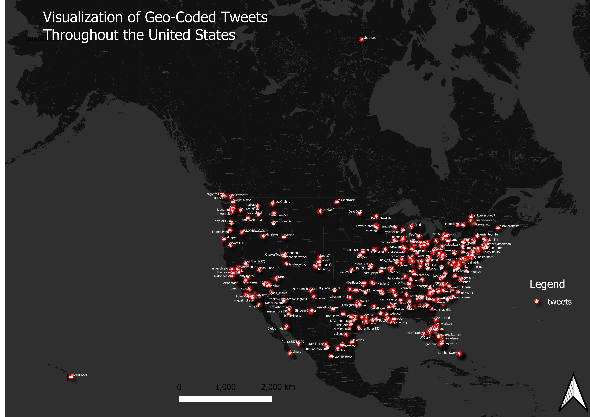

 <h1> 
A Collection of Geo-Coded Tweets Throughout the United States 
 </h1>  

 
<h4> 
 The map above illustrates a collection of geo-coded tweets throughout the United States. Each tweet is symbolized by a star, with their corresponding Twitter handle next to them. They are positioned according to longitude and latitude coordinates. Based off the map and its collection of tweets, clustering appears to occur in the northeast, upper midwest and southeast. Additionally, there is some 'tweeting' done in the PNW, California and Texas. There seems to be little to no Twitter activity around the Montana, Wyoming and Dakotas region. Nonetheless, the spatial distribution of Twitter data (it could be completely different with a new set) is based off the collection of sample tweets provided by the course repository since I had an issue registering for a Twitter developer account. This set of tweets seem to reflect a younger generation or demographic that show no filter and talk about current and random topics such as stimulus checks and Coronavirus. 
 </h4>
